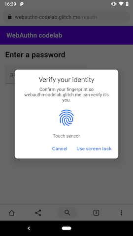
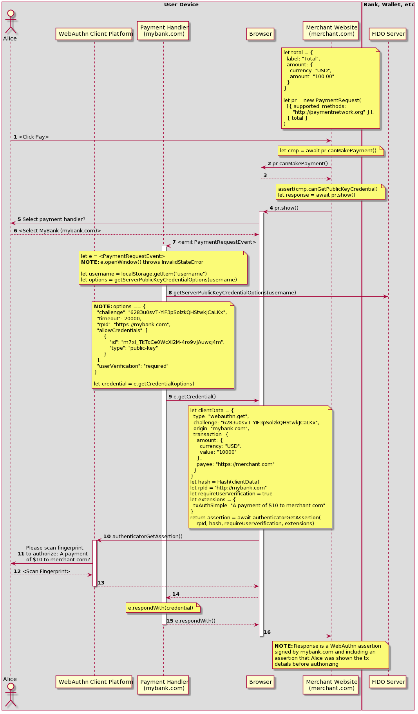
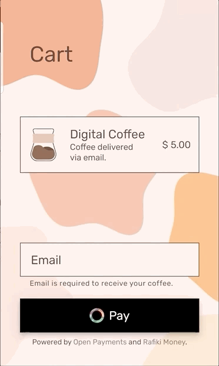

# WebAuthN + Payment Request = Payment AuthZ

Can we use a combination of Payment Request API and WebAuthN internals and UI to
get Transaction Confirmation (Dynamic Linking)?

**Transaction Confirmation (TxConf)** is a feature of FIDO that guarantees to
the Relying Party (RP) that the user saw the same transaction details that are
signed by their authenticator, i.e. WYSIWYS (What You See Is What You Sign)

While Transaction Confirmation is technically possible it is not available as
function of any WebAuthn implementation today. Instead the prompt shown to users
is always a generic authentication UI such as the example below.

### Why is transaction confirmation important?

In the absence of TxConf an authenticator can ONLY assert that the challenge
provided by the RP was signed inside the authenticator at the consent of the
user (who provided the necessary gesture to "unlock" the authenticator, e.g.
biometric scan, PIN etc).

The RP has **no guarantees** about what the user viewed when challenged.

This is fine if simply **authenticating** the user is the requirement (e.g. for
login). However, when requesting that a user consent to, and authorize, a
transaction this is only half of the problem solved.

For example, imagine a bank user is being requested by a third-party to
authorize a payment from their bank account. The bank is the relying party in
this case.

The UI that displays the transaction detail to the user, and the interactions
with the authenticator entirely controlled by the third-party (except the
challenge which was provided by the bank). There is no guarantee that the data
displayed and the data signed are the same.

Even if the bank includes the transaction detail in the challenge they can't be
certain that the same details will be displayed to the user.

The third-party MAY prompt the user to authorize a payment of
$10 but submit a transaction to the bank of $10 000 along with a valid signature
from the user's authenticator.

## Background

This is _roughly_ the current state of things:

- When WebAuthn is invoked the user interface is controlled by the platform so
  it is not as secure as a secure hardware display but it's definitely better
  than the application/Web display under control of the RP that invokes
  WebAuthN.
- Very few authenticators support Transaction Confirmation as they don't have a
  secure hardware display.
- Browsers have not implemented the `txAuthSimple` or `txAuthGeneric` extensions
  (which are the WebAuthn entrypoint to this functionality) for this reason and
  therefore these are likely to be removed in future.
- Browsers have also expressed concerns about accepting free-text as input to a
  TxConf algorithm.
- PaymentRequest objects have structured transaction details (not free text)
  which could form the basis of the Transaction Confirmation Display.

## Proposal

We need a way to invoke WebAuthn specifically for payments such that we can
leverage:

- The fact that the transaction data that is held by the PaymentRequest object
  is well structured
- The fact that we can invoke APIs from within a Payment Handler's
  PaymentRequestEvent event handier and have the current PaymentRequest object in
  context
- The fact that the platform (not the browser or website) renders the UI that is
  shown to the user when getting an attestation

Below is a proposed flow. Code snippets are used to provide some indication of
the logic being performed at each step by the component overlaid by the note.

The website has created a Payment Request where one of the supported payment
methods is for a payment network/system that accepts FIDO assertions that
include Transaction Authorization as a valid payment credential.

**IMPORTANT**: Not that the merchant has not requested a specific relying party
or payment handler/app. Any RP on the `paymentnetwork.org` network is accepted
as long as they can produce the assertion required.

1. The user clicks pay
2. Inside the click event handler the website calls `canMakePayment` on the
   `PaymentRequest` object it created.
3. The response to `canMakePayment` has a new property
   `canGetPublicKeyCredential` which is `true` telling the merchant that the
   users has got a Payment Handler installed that supports this mechanism of
   authorization and that they can produce a signed assertion including
   Transaction Confirmation. This is important to the merchant as it is now
   assured that the checkout flow the user will follow is consistent and low
   friction.
4. The website calls `show()` to invoke the payment flow
5. The browsers prompts the user to pick a Payment App from the set that have
   all asserted an ability to support the requested payment methods (in this
   case `https://paymentnetwork.org`)
6. The user selects the **MyBank** payment app
7. The browser invokes the MyBank payment handler by emitting the
   PaymentRequestEvent to the mybank.com service worker's event handler.
8. The payment handler is unable to call `e.openWindow` to show it's own UI as
   the merchant was given a guarantee that the user would get the consistent
   low-friction UI provided by the FIDO Client Platform so the Payment App is
   not able to show it's own UI too.

   The payment handler gets the current user's username from local storage (or
   maybe from the Credential Management API). The payment handler calls out to
   its FIDO server to get a challenge. (_This could be expanded to include the
   details of the transaction so that these are also included in the
   challenge._)

9. The payment handler invokes WebAuthn via an API proxy on the
   `PaymentRequestEvent` object. This follows the same pattern as `e.openWindow`
   which is a similar API to window.open but only available within the context
   of a payment handler. Instead of calling WebAuthn via
   `navigator.credentials.get(...)` we want to invoke the WebAuthN internals
   automatically at some point in the Payment Request API flow, pass the details
   of the payment into this process and get back an attestation that these
   details were displayed to the user when they were prompted to authenticate.

   The `clientData` constructed by the browser includes transaction details that
   are passed to the client platform along with the txAuthSimple prompt to use
   for Transaction Confirmation.

   **txAuthSimple**: _It's not clear if using the txAuthSimple extension is the
   right thing to do here or not. Some guidance from WebAuthn WG and platforms
   would be helpful._

   **txAuthGeneric**: _The logo of the RP is known to the browser (it is pulled
   from the web app manifest). Could this also be passed to the client platform
   in the txAuthGeneric extension so it can also be displayed?_

10. The browser invokes the FIDO client platform to get the assertion
11. The user is prompted to confirm the transaction and authenticate
12. The user scans their fingerprint (or face or other gesture)
13. The assertion is returned to the browser
14. The assertion is passed to the payment handler
15. The payment handler responds to the payment request with the assertion as
    the complete response.
16. The promise returned by `show()` resolves to an assertion from WebAuthn.

    This is the first time the merchant is made aware of who the RP is
    (mybank.com).

    Merchant can submit this to `paymentnetwork.com` along with any other
    transaction details to complete the payment.

The video below show a demonstration of how such a flow COULD look. This is using the experimental minimal UI from Chrome on Android so it is not a true FIDO assertion and does not show the payee details in the prompt but it helps to illustrate the flow.

## Why?

There are a number of benefits to this approach, and changes in the ecosystem that make this proposal more relevant now than it might have been in the past:

1. More and more online payments are being done on mobile devices
2. WebAuthn capabilities on end user devices is becoming ubiquitous (especially on mobile)
3. Merchants have concerns about losing control of the checkout flow. In this flow the merchant is able to invoke `show()` knowing that the user will get a consistent low-friction experience irrespective of who the RP is.
4. The payment app (RP) doesn't need to provide/maintain any UI making deployment for the RP much simpler. Also see, [Can we skip the payment handler](#can-we-skip-the-payment-handler)?
5. Any payment system can leverage a standardised payment credential that is easy for any of their participants (the RPs) to produce using standard FIDO infrastructure. This could augment existing systems in the same way that 3DS augments card payments today.
  
## Can we skip the Payment Handler?

Perhaps there is a way to simply hook into `navigator.credentials.store()` so that RPs don't need to provide a payment handler at all?

When a credential is stored by the RP it could tag it as usable for payments and specify the payment methods that it supports. The browser would record this and the RP would be available as an option when PR API is invoked and the merchant is requesting this flow.

## Challenges

This proposal requires updates to client platforms to support Transaction Confirmation however the extent to which this is true and where the changes are required is unclear.

## References

FIDO Server interaction examples from
[FIDO Alliance - Server Requirements and Transport Binding Profile](https://fidoalliance.org/specs/fido-v2.0-rd-20180702/fido-server-v2.0-rd-20180702.html#authentication-example-credential-get-options)

## Acknowledgments

Thanks to Dirk Balfanz, Danyao Wang, Rouslan Solomakhin, Matt de Haast, Jeff Hodges, John Bradley, John Fontana, Ian Jacobs, Cairin Michie, Marcos Caceres, Benjamin Tidor and many others for help and feedback on this so far.